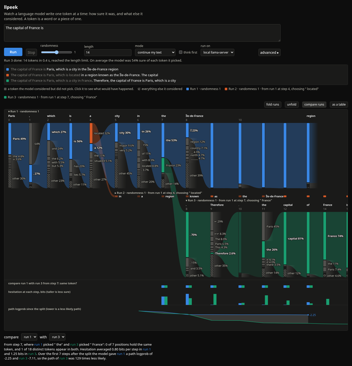

# llpeek

Large Language Peek

llpeek shows what a local LLM considered at each step of a generation. For every
token it produced, you see the top candidates and how the probability was split
between them.

Inference runs in [llama.cpp](https://github.com/ggml-org/llama.cpp), through one
of two engines:

- `llama-server` on your machine. It reports per-token top-k log-probabilities
  over HTTP.
- [wllama](https://github.com/ngxson/wllama), llama.cpp compiled to WebAssembly.
  Everything runs inside the browser.

llpeek is only the front end. It turns that stream of probabilities into a chart
you can read.

<a href="docs/screenshot-dark.png"></a>

<sub>Click for full size. <a href="docs/screenshot-light.png">Light mode</a>. Live site: <a href="https://wistrand.github.io/llpeek/">wistrand.github.io/llpeek</a>.</sub>

How to read the chart: each column is one generated token. Node height is
probability. The colored node is the token that was sampled, gray nodes are
candidates that were not, and the hatched node is everything outside the top-K.
The ribbon carries the sampled token into the next step. The fading stubs mark
the candidates that were not picked. Click one to branch from there.

Column width is hesitation. Where the model was sure, the column is only as wide
as its token and the trace reads like text. Where it deliberated, the column
opens to show the candidates.

## Requirements

- A GGUF model in `~/models`. The defaults use `Qwen_Qwen3.5-2B-Q8_0.gguf`
  (see the quick start for the downloader).
- Deno, for the task runner and helper scripts. The app itself is one HTML file.
- For the server engine: `llama-server` on `PATH` (the Arch/Manjaro `llama.cpp`
  package installs it to `/usr/bin`). For the browser engine: a browser with
  WebAssembly threads; the page loads wllama from a CDN when you pick it.

## Quick start

```bash
deno task model qwen3.5-2b   # download the 2B model into ~/models (2.1 GB, resumable, once)
deno task dev                # llama-server on :8089 and the site on http://localhost:8000
```

Then open http://localhost:8000/app.html, type a prompt and press Run (Ctrl+Enter).
The landing page at http://localhost:8000/ is the same one GitHub Pages publishes.

- `deno task model` with no arguments lists the known models and marks the
  ones you already have; `deno task model smollm3-q4` fetches another.
- `deno task llama` and `deno task serve` run the two halves separately.
  Append `-m <model>` or other llama-server flags to the llama task to override.
- No llama-server? Set "run on" to "this browser" and press "load model". The
  default is the same 2B Qwen from Hugging Face, downloaded once and cached by
  the browser; the list also has SmolLM2 360M, Gemma 3 1B, Llama 3.2 1B and
  SmolLM3 3B, and any CORS-enabled GGUF URL under 2 GB works. A note next to
  the button gives the download size before you start. The published site
  offers only this engine; the server option appears when the page is served
  by `deno task serve`, which also looks for the server when the page opens.
- Hover a node for details, click a gray candidate to branch from it, click a
  run's label to fold it, or switch to "as a table". With two runs on screen,
  the compare tracks under the lanes line them up from the step where they
  part: which tokens match, how much the model hesitated at each step, and how
  the path probability drifts apart ("compare runs" toggles them).
  Sampling knobs, the server address, the threshold that decides when a
  column opens, and the technical readouts are under "advanced".

## Related

llpeek is a companion to [llav](https://github.com/wistrand/llav), Large
Language Verdicts, which asks a local model yes/no, multiple-choice and rating
questions and returns probabilities read from the same next-token
log-probabilities that llpeek draws. llav is the API; llpeek is the picture of
what the model is doing underneath. Both run on llama.cpp locally and on wllama
in the browser, and both use the GGUF models in `~/models`.

## Site

`docs/` is the whole thing: the landing page, the app (`app.html`, one file, no
build step) and the screenshots. `deno task serve` serves it locally and GitHub
Pages publishes it (deploy from branch, folder `/docs`). `deno task pages`
serves it exactly as Pages will: browser engine only, no isolation headers.

## Status

Working: streaming generation, the Sankey trace, branching from any candidate,
side-by-side runs, extending runs by raising the length, chat-template mode with
thinking on or off, a sampler view showing what survived top-k / top-p / min-p /
temperature, collapsible lanes, table view, a compare view for two runs after
they diverge, light and dark mode. See `agent_docs/plan.md`.
